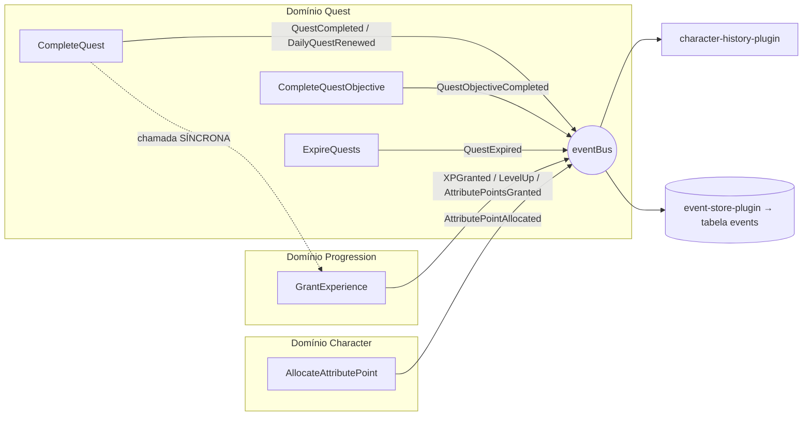

# Relatório de Auditoria — Solo Leveling (MVP)

> Auditoria baseada **exclusivamente** no código-fonte, na estrutura do projeto e na
> documentação existente (`docs/business_rules.md`, `docs/domains.md`, `ADRs/`).
> Nenhuma regra de negócio foi inventada. Toda conclusão referencia `arquivo:linha`.
>
> Data: 2026-08-01 · Branch: `main` · Último commit: `fd999be [0.1.37] progression engine`

---

## Sumário Executivo

Projeto **maduro para um MVP**: monólito modular em DDD com camadas limpas, motores de
progressão puros e testáveis, event bus com event store, e um frontend Expo/Tamagui bem
estruturado (React Query + guardas de rota + i18n). A engenharia de use-cases e testes
unitários é de qualidade acima da média para esta fase.

Porém a auditoria encontrou **falhas de segurança graves** e **inconsistências entre
`business_rules.md` e o código** que precisam de decisão antes de qualquer nova
implementação (Fase 15).

| # | Severidade | Achado | Evidência |
|---|-----------|--------|-----------|
| S1 | 🔴 CRÍTICO | `PATCH /identity/password` **sem autenticação** → account takeover | `identity/api/routes.ts:68`, `update-user.ts` |
| S2 | 🔴 ALTO | Mass assignment em `PATCH /characters` (`stats`) → atributos/powerScore/rank arbitrários (burla a economia de rest points) | `update-character.ts:25`, `character/api/routes.ts:35` |
| S3 | 🟠 ALTO | `errorHandler` **nunca registrado** → vazamento de erros internos (Prisma) em 500 e contrato de erro quebrado | `app.ts` (sem `setErrorHandler`), `http/error-handler.ts` |
| S4 | 🟠 ALTO | **Zero validação de input (Zod)** no backend; todas as rotas fazem `req.body as ...` | todas as `*/api/routes.ts` |
| S5 | 🟠 ALTO | `rewardXp` arbitrário na criação/edição de quest → inflação de XP/level | `create-quest.ts:77`, `update-quest.ts:53` |
| T1 | 🟠 ALTO | Suíte de testes do backend **vermelha** (`2 failed / 165 passed`) e **sem CI** | `create-quest.test.ts`, `mvp-flow.test.ts` |
| D1 | 🟡 MÉDIO | Sem `prisma.$transaction` em operações multi-passo → estado inconsistente | `grant-experience.ts`, `allocate-attribute-point.ts`, `complete-quest.ts` |
| D2 | 🟡 MÉDIO | Schema sem `onDelete` → `DELETE /characters` falha por FK | `schema.prisma`, `delete-character.ts` |
| A1 | 🟡 MÉDIO | Duas curvas de XP divergentes; `ProgressionEngine` (classe/strategy) é código morto no runtime | `progression.engine.ts` vs `level.engine.ts` |

Conflitos de regra que exigem **decisão do product owner** estão consolidados na
seção [Conflitos que Exigem Decisão](#conflitos-que-exigem-decisão).

---

## Fase 1 — Mapa da Arquitetura

### Visão geral (monorepo Turborepo)

```
solo-leveling/
├── apps/
│   ├── backend/      Fastify 5 + Prisma 6 + PostgreSQL — monólito modular DDD
│   └── frontend/     Expo 57 (React Native 0.86 + RN Web) + Tamagui + React Query
├── packages/
│   └── shared-types/ Tipos TS compartilhados (⚠ NÃO importado por ninguém — ver A? abaixo)
├── ADRs/             ADR-001 (monólito modular), ADR-002 (React Native + Expo Router)
├── docs/             business_rules.md, domains.md
└── turbo.json        build/dev/lint/type-check/test/db:*
```

### Backend — camadas por domínio (Clean Architecture)

Padrão consistente em **todos** os domínios:
`api/` (rotas Fastify) → `application/` (use cases) → `domain/` (entidades + regras puras + eventos) → `infrastructure/` (repos: `in-memory-*` + `prisma-*`).

| Domínio | Use cases | Domínio/Regras | Repositórios | Eventos publicados |
|---------|-----------|----------------|--------------|--------------------|
| **identity** | register, login, refresh-session, update-user | `user.ts` | `user-repository`, `in-memory-prisma` | — |
| **character** | create, update, delete, get-profile, get-history, allocate-attribute-point, upload-avatar | `character`, `character-history`, `character-rest-point`, `avatar-storage`, `events` | prisma + in-memory (character, history, rest-point, avatar) | `AttributePointAllocated` |
| **quest** | create, update, delete, get, list, list-categories, complete-quest, complete-quest-objective, expire-quests | `quest`, `quest-category`, `events` | prisma + in-memory (quest, category) | `QuestCompleted`, `QuestObjectiveCompleted`, `DailyQuestRenewed`, `QuestExpired` |
| **progression** | grant-experience | engines: `progression`, `level`, `power-score`, `attribute`, `rank`, `progression.strategy` · entities: `character-progression` | prisma + in-memory progression | `XPGranted`, `LevelUp`, `AttributePointsGranted` |

**Engines (progression):** `level.engine` (`calculateXpToNextLevel`), `power-score.engine`
(`calculatePowerScore`), `attribute.engine` (`ATTRIBUTE_POINTS_PER_LEVEL=5`,
`AUTO_ATTRIBUTE_INCREMENT_PER_LEVEL=1`), `rank.engine` (`calculateRank`),
`progression.engine` (classe `ProgressionEngine` + `applyExperienceGain`),
`progression.strategy` (`ContinuousCurveStrategy`).

**Infraestrutura transversal (`src/infrastructure/`):** `prisma/plugin`, `jwt/plugin`,
`events/event-store-plugin` (persiste todo evento), `events/character-history-plugin`
(consumer que gera feed de histórico), `scheduler/quest-expiration-scheduler-plugin`
(node-cron a cada 12h), `storage/r2-avatar-storage` (Cloudflare R2/S3),
`http/error-handler` (**não registrado**), `logger/config`, `cache/index`
(`InMemoryCache` — **não utilizado**).

**Shared (`src/shared/`):** `errors/app-error` (hierarquia `AppError`),
`events/domain-event` (event bus singleton + `DomainEvent`), `security/password`
(bcrypt), `types`, `utils` (`generateId`, `date-filter`).

### Frontend — módulos por feature

```
src/
├── app/                 Expo Router (file-based): _layout, index, login, register,
│                        (app)/{home, inventory, profile, quests/*, status/*}
├── modules/
│   ├── auth/            api(useLogin/useRegister/requests) · components(Login/RegisterForm)
│   │                    · schemas(zod) · screens · session(SessionProvider)
│   ├── character/       api(profile/history/create/allocate/upload) · components · screens
│   ├── home/            components(HeroCard, AttributesPanel, DailyMissionsPanel...) · screen
│   ├── quest/           api(useQuests/useQuest/useCreate/useComplete/objectives/categories)
│   │                    · components(QuestCard, ObjectiveRow) · schemas · screens
│   ├── progression/     engine (espelho do backend — DIVERGENTE) · useCharacterProgress
│   ├── inventory/ · profile/   screens (placeholder)
└── shared/              api(http-client + interceptors, query-client, get-error-message)
                         · components(System*, FormField, ProgressBar) · i18n(en/pt)
                         · notifications(Toast + Push) · storage(token) · theme(tamagui)
```

**Stores/estado:** não há Zustand (apesar de citado no checklist da auditoria). Estado de
servidor via **React Query**; sessão via **Context** (`SessionProvider`). Escolha coerente.

### Pipelines / Infra

- **Turbo:** `turbo.json` com build/dev/lint/type-check/test/db:*. OK.
- **Docker:** `apps/backend/docker-compose.yml` = Postgres 16 (dev local). Não há
  Dockerfile de deploy da aplicação. `Dockerfile.claude`/`docker-compose.claude.yml` são
  apenas para rodar o agente Claude, não a app.
- **CI/CD:** **ausente** — não existe `.github/workflows/`.

### Arquivos de referência (exigidos pelo prompt)

| Arquivo | Existe? | Observação |
|---------|:------:|-----------|
| `business_rules.md` | ✅ | Em `docs/` (não na raiz) |
| `README.md` | ❌ | **Ausente na raiz e nos apps** (só `.expo/README.md` gerado) |
| `ADR/*` | ✅ | Em `ADRs/` (ADR-001, ADR-002) |
| `docs/*` | ✅ | business_rules, domains |
| `package.json` | ✅ | raiz + apps + packages |
| `turbo.json` | ✅ | — |
| `docker-compose.yml` | ⚠️ | Apenas `apps/backend/docker-compose.yml` (Postgres) |
| `prisma/schema.prisma` | ✅ | `apps/backend/prisma/` |
| `.github/workflows/*` | ❌ | **Ausente** |

---

## Fase 2 & 3 — Business Rules vs Implementação (Gap Analysis)

Legenda: ✅ implementada · ⚠️ parcial/divergente · ❌ inexistente

### Requisitos Funcionais

| Regra (`business_rules.md`) | Marcado | Real | Evidência / Observação |
|---|:--:|:--:|---|
| Registrar usuário | [x] | ✅ | `register-user.ts` |
| Autenticar usuário | [x] | ✅ | `login-user.ts` + JWT |
| Criar personagem | [x] | ✅ | `create-character.ts` |
| Status do personagem (healthy/poisoned) | [ ] | ❌ | Sem campo/lógica de status |
| Ver perfil do personagem logado | [x] | ✅ | `get-character-profile.ts` (retorna rank+powerScore+restPoints) |
| Power score = soma de atributos | [x] | ✅ | `power-score.engine.ts` |
| Não poder mudar o nome do personagem | [ ] | ❌ | `update-character.ts:28` **permite** alterar `name` |
| Histórico de quests concluídas | [ ] | ✅ | Doc desatualizada — `character-history-plugin.ts`, rota `/history` |
| Dashboard de métricas | [ ] | ❌ | Não implementado |
| Criar quest só para o próprio personagem | [ ] | ✅ | Doc desatualizada — ownership via token em `create-quest.ts` |
| Completar quest a qualquer hora do dia | [ ] | ⚠️ | Deadline diária = fim do dia (`quest.ts:120`), mas em **hora local do servidor**, não GMT-3 |
| Penalidade por perder consistência | [ ] | ❌ | Expiração marca `failed`, mas **sem penalidade** de XP |
| Avisar sobre quests diárias/semanais | [ ] | ❌ | Sem weekly; sem notificações |
| Notificar a cada 2 dias (semanais) | [ ] | ❌ | Não implementado |
| Dividir quest em mini-quests por % | [ ] | ⚠️ | `QuestObjective` + `calculateObjectivesCompletionRatio` (regra dos 70% da main) |
| Adicionar período para completar | [x] | ✅ | `expiresAt` + `calculateDefaultDeadline` |
| Não remover quest iniciada | [ ] | ⚠️ | `delete-quest.ts:30` bloqueia `in_progress` e `completed` (mas `in_progress` nunca é setado no fluxo atual) |
| Não editar/adicionar atributo | [x] | ✅ | Conjunto fixo; sem endpoint de criar atributo |
| Ver pontos de atributo no header | [ ] | ⚠️ | `AttributesPanel`/`HeroCard` exibem, mas não como header persistente |
| Não permitir downgrade de atributo | [ ] | ⚠️ | `allocate` só soma (amount>0), mas `update-character` permite qualquer valor |
| Logar a atualização da quest | [ ] | ❌ | Histórico cobre conclusão/objetivo/renovação, **não** edições |

### Regras de Negócio

| Regra | Marcado | Real | Evidência / Observação |
|---|:--:|:--:|---|
| E-mail duplicado proibido | [x] | ✅ | `register-user.ts:16` (email+username únicos) |
| Não criar/editar título (MVP) | [x] | ⚠️ | Criação seta título, mas `update-character.ts:29` **permite editar** — **conflito** |
| Escolher título uma única vez | [ ] | ⚠️ | Setado na criação; editável via API |
| Não criar segundo personagem | [x] | ✅ | `create-character.ts:31` |
| Usuário cria a própria quest (MVP) | [ ] | ✅ | Doc desatualizada — implementado |
| Quest ≥70% = done **se for diária** | [ ] | ⚠️ | **Conflito**: código aplica 70% à **main** (`complete-quest.ts:51`), não à diária |
| Quest deve ter ≥1 categoria | [x] | ⚠️ | `categoryId` é **opcional/nullable** (`schema.prisma:102`, `create-quest.ts`) — não enforced |
| Quest deve ter descrição | [x] | ✅ | `create-quest.ts:73` |
| XP muda em passos de 50 (bônus) | [ ] | ❌ | `rewardXp` é livre |
| Quest não pode ter 0 de reward | [x] | ✅ | `create-quest.ts:77` |
| Quest deve ter período (???) | [ ] | ⚠️ | Deadline default aplicado; regra marcada como incerta na fonte |
| Quest concluída após deadline não conta | [ ] | ⚠️ | Só **diária** rejeita após deadline; **main** ainda pode ser concluída após 28 dias |
| Quest não atualizável após concluída | [ ] | ✅ | `update-quest.ts:41` e `complete-quest-objective.ts:36` bloqueiam `completed` |
| Classificação por ranks (E..S → XP) | [ ] | ❌ | `questRank` é string livre; **sem** mapa rank→XP |
| Diária aceita como done… aos domingos | [ ] | ❌ | Não implementado (regra ambígua) |
| Level up: +1 em todos atributos | [ ] | ✅ | `attribute.engine.ts` (`applyAutoAttributeGains`) |
| Power score = soma dos atributos | [ ] | ✅ | `power-score.engine.ts` |
| Atributo não pode ser 20 > 2º maior | [ ] | ❌ | Não implementado |
| Power score → rank do personagem | [ ] | ✅ | `rank.engine.ts` implementa exatamente as faixas; exposto em `get-character-profile` |

### Requisitos Não-Funcionais

| Regra | Marcado | Real | Evidência |
|---|:--:|:--:|---|
| Toda quest salva no banco | [ ] | ✅ | `prisma-quest-repository.ts` |
| Persistência em PostgreSQL | [x] | ✅ | `schema.prisma`, `docker-compose.yml` |
| Event bus para eventos (MVP) | [ ] | ⚠️ | In-memory bus + event store (sem outbox/entrega garantida) |
| Notificações via WhatsApp | [ ] | ❌ | Só scaffolding de push no FE (`expo-notifications`) |
| Usuário identificado por JWT | [x] | ✅ | `jwt/plugin.ts` |
| Timezone das quests em GMT-3 (MVP) | [ ] | ❌ | `date-filter.ts`/`quest.ts` usam **hora local do servidor** |

### Itens do Gap Analysis (Fase 3)

- **Implementados (não marcados na doc):** histórico de quests, criação de quest pelo dono,
  auto +1 por atributo no level up, faixas de rank por power score.
  → **Ação:** atualizar os checkboxes de `business_rules.md`.
- **Incompletos/parciais:** completar “a qualquer hora do dia” (TZ), mini-quests por %,
  quest concluída após deadline (só diária), pontos no header, event bus (sem outbox).
- **Inexistentes:** status healthy/poisoned, dashboard, penalidade de consistência,
  weekly quests + avisos, notificações WhatsApp, passos de 50 no XP, rank→XP, cap de
  atributo (+20), GMT-3, domínios Reward e Notification no backend.
- **Duplicados:** curva de XP (2 implementações — `ProgressionEngine`/strategy vs
  `applyExperienceGain`/`level.engine`); engine de progressão FE **e** BE (divergentes);
  tipos `ID`/`Paginated` redefinidos em backend e frontend em vez de usar `@repo/shared-types`.
- **Inconsistentes:** título editável apesar de `[x]` “não editar título”; 70% aplicado à
  main e não à diária; `categoryId` opcional apesar de “≥1 categoria”; limite de 3 diárias
  no código vs 5 nos testes; `luck` no código vs `CHA` na `domains.md`.
- **Obsoletos:** `InMemoryCache` (não usado), classe `ProgressionEngine`+`ContinuousCurveStrategy`
  (não usados no runtime), `packages/shared-types` (não importado).

---

## Fase 4 — Arquitetura (DDD / SOLID / Clean)

### Pontos fortes

- **Monólito modular real** (ADR-001): domínios isolados, dependências apontando para
  dentro (rotas → use case → domínio). Repositórios são **interfaces no domínio**
  (`CharacterRepository`, `QuestRepository`, `ProgressionRepository`) com implementações
  `prisma-*` e `in-memory-*` → **DIP** bem aplicado e testabilidade alta.
- **Use case por arquivo**, entrada tipada, erros de domínio explícitos (`AppError`).
- **Engines puras** e injetáveis; `ProgressionEngine` documenta Strategy/OCP.
- **Eventos como funções-fábrica** tipadas (`createXxxEvent`) — padrão uniforme.
- **Inversão de publicação de eventos**: use cases recebem `publishEvent` injetável
  (default `eventBus.publish`), o que torna os testes determinísticos.

### Violações / riscos

1. **Acoplamento cross-domain direto** (sem anticorruption): `quest` importa
   `GrantExperienceUseCase` de `progression` e instancia diretamente
   (`quest/api/routes.ts:13,65`; `complete-quest.ts:2`). O contrato dos domínios previa
   integração **por eventos** (`QuestCompleted` → progression), mas aqui a progressão é
   chamada **de forma síncrona e imperativa**. O evento `QuestCompleted` existe mas **não
   tem consumer de progressão** — só alimenta o histórico. → decisão arquitetural a
   registrar (ver A1/E-orfãos).
2. **Código morto de arquitetura**: `ProgressionEngine` + `ContinuousCurveStrategy` (a peça
   “OCP/Strategy” mais elaborada) **não é usada** pelo fluxo real de XP, que usa
   `applyExperienceGain`/`level.engine` (curva quadrática diferente). Duas fontes de verdade
   para “nível a partir de XP”.
3. **Composition root espalhado**: cada `routes.ts` instancia repos/use-cases manualmente
   (sem container/factory). Aceitável no MVP, mas duplica fiação e dificulta trocar
   implementação (ex.: cache, transações).
4. **Sem camada de DTO/validação** entre HTTP e use case: `req.body as T` (ver S4).
5. **`packages/shared-types` não é usado** — o principal benefício do monorepo (contrato de
   tipos FE↔BE) não é realizado; tipos são duplicados.

### Acoplamento & Coesão

- Coesão **alta** dentro de cada domínio.
- Acoplamento **baixo** via interfaces, exceto quest→progression (imperativo) e o
  `character-history-plugin` que conhece eventos de 3 domínios (aceitável: é um read-model
  transversal).
- **Dependências circulares:** não detectadas. `progression` depende de `character` (tipo
  `CharacterStats`) e `quest` depende de `character`+`progression`; grafo é acíclico.

---

## Fase 5 — Segurança

| ID | Sev | Achado | Evidência | Recomendação |
|----|-----|--------|-----------|--------------|
| S1 | 🔴 CRÍTICO | `PATCH /identity/password` sem `authenticate`; `UpdateUserUseCase` troca senha por `{email,newPassword}` → **qualquer um reseta a senha de qualquer conta** | `identity/api/routes.ts:68`, `update-user.ts:13` | Exigir auth + senha atual; escopar ao `req.user.sub` |
| S2 | 🔴 ALTO | Mass assignment: `PATCH /characters` repassa `stats` que `UpdateCharacterUseCase` aplica direto → set `strength:999999`, powerScore/rank arbitrários, **burla rest points** | `character/api/routes.ts:35`, `update-character.ts:25` | Remover `stats`/`level`/`powerScore` do update; mutação só via `allocate-attribute-point` |
| S3 | 🟠 ALTO | `errorHandler` **não registrado** (`app.ts` sem `setErrorHandler`) → 500 pode vazar msg interna; erros Prisma (ex.: FK) viram 500 crus; contrato `{error,message}` não aplicado | `app.ts`, `http/error-handler.ts` | `app.setErrorHandler(errorHandler)` |
| S4 | 🟠 ALTO | Sem validação de schema no backend (`req.body as ...`) em **todas** as rotas | `*/api/routes.ts` | Zod (ou JSON Schema do Fastify) por rota; validar params/query/body |
| S5 | 🟠 ALTO | `rewardXp`/`minLevel`/`rewardGold` livres → inflação de XP/level | `create-quest.ts:77`, `update-quest.ts:53` | Derivar XP do `questRank` (tabela), limites máximos |
| S6 | 🟡 MÉDIO | Sem rate limiting → brute force em `/login`, `/register`, `/refresh` | `app.ts` | `@fastify/rate-limit` |
| S7 | 🟡 MÉDIO | Mass assignment de `status` em `update-quest` → reabrir/forçar estado sem regras | `update-quest.ts:63` | Não permitir `status` via update genérico |
| S8 | 🟡 MÉDIO | CORS `origin:true` + `credentials:true` (reflete qualquer origem) | `app.ts:24` | Allowlist de origens por ambiente |
| S9 | 🟢 BAIXO | Upload confia no `mimetype` declarado (spoofável); sem sniffing de magic bytes | `character/api/routes.ts:79`, `upload-character-avatar.ts:26` | Validar assinatura do arquivo; recomprimir |
| S10 | 🟢 BAIXO | Token de acesso em `localStorage` no web (exposto a XSS) | `token-storage.ts:8` | Aceitável no MVP; documentar risco |
| S11 | 🟢 BAIXO | Seed cria `admin@admin.com` / senha `admin` | `prisma/seed.ts:17` | Nunca rodar seed em produção; senha forte |

**Positivos:** bcrypt (rounds 10); JWT com `type` access/refresh verificado
(`jwt/plugin.ts:22`, `refresh-session.ts:28`); refresh token em cookie **httpOnly**
(`secure`/`sameSite` por ambiente, `identity/api/routes.ts:15`); ownership derivada do
**token** (`req.user.sub`), nunca do body, em todos os use cases de character/quest;
Prisma (queries parametrizadas → sem SQL injection); `helmet` habilitado; sem
`eval`/HTML injection no backend. CSRF é mitigado pelo uso de Bearer token (não cookie)
para as rotas de negócio; o cookie de refresh é `httpOnly` e restrito a `/api/v1/identity`.

---

## Fase 6 — Banco de Dados (Prisma / PostgreSQL)

**Modelos:** `User`, `Character`, `CharacterRestPoint` (1-1), `CharacterHistory`,
`QuestCategory`, `Quest`, `QuestObjective`, `Progression` (1-1), `Reward`, `Event`,
`Notification`. Migrations versionadas (11 migrations) e `migration_lock.toml` presente.

### Achados

- **Sem `onDelete`/`onUpdate`** em qualquer relação → `DELETE /characters` quebra por FK
  quando há progression/quests/history/restPoints/rewards. `delete-character.ts:19` chama
  `prisma.character.delete` direto. (D2) → definir `onDelete: Cascade` (ou soft delete) e/ou
  deletar filhos em transação.
- **Sem índices** além de PK/unique. Consultas por `characterId` (quests, history,
  progression, rewards) e por `userId` (characters) fariam scan. Adicionar `@@index`.
- **Sem soft delete** e **sem versionamento/optimistic locking** (`@version`). Concorrência
  em XP/rest points pode causar lost update (ver D1).
- **Duplicação de estado de progressão:** `level`/`experience`/`powerScore` existem em
  `Character` **e** `Progression` (`totalExperience`). O fluxo real grava em ambos via
  `InMemoryProgressionRepository`/`PrismaProgressionRepository`. Fonte de verdade ambígua.
- **`Event` é um event store (append log), não um outbox**: sem coluna de status/processado,
  sem `aggregateId`/`eventId` persistidos como colunas (vão só no JSON), sem índice. Não há
  entrega garantida nem replay idempotente.
- **`Reward` e `Notification`**: existem no schema, mas **sem lógica** no backend
  (rotas comentadas em `app.ts:39-40`). `rewardGold` é salvo na quest mas nunca vira `Reward`.
- **JSON:** `Event.eventPayload` e `Notification.metadata` como `Json` — ok.
- **`QuestCategory.createdBy`** modela dono por usuário, mas `list-quest-categories` retorna
  **todas** (categorias efetivamente globais, semeadas sob `admin`). Modelagem vs uso divergem.

---

## Fase 7 — Frontend (Expo / React Query / Tamagui)

### Pontos fortes

- **Expo Router** com guarda declarativa `Stack.Protected guard={isAuthenticated}`
  (`app/_layout.tsx:27`) — separa área autenticada de login/registro.
- **HTTP client robusto** (`shared/api/http-client.ts`): interceptor de request injeta
  Bearer; interceptor de response faz **refresh 401 com single-flight** (`refreshPromise`)
  e evita loop no próprio `/refresh`.
- **Sessão** (`SessionProvider.tsx`): silent refresh a cada 10 min, degradação graciosa
  quando o backend está indisponível (mantém último token).
- **React Query** com `retry:1` e `staleTime:60s`; hooks por recurso (`useQuests`,
  `useCharacterProfile`…). **RHF + Zod** nos forms (`register.schema.ts`, `create-quest.schema.ts`).
- **Estados de UI** bem tratados: `HomeScreen` cobre loading (`LoadingIndicator`),
  empty→CTA (criar personagem via `isCharacterNotFound`) e erro.
- **i18n** pt/en com `LanguageProvider`; Toasts (`ToastProvider`) e Push scaffolding.
- Componentes de design system próprios (`System*`, `ProgressBar`, `FormField`).

### Pontos de atenção

- **Sem Skeletons** dedicados (só spinner) e **sem Error Boundary** global.
- **Engine de progressão duplicada no FE** (`modules/progression/engine/*`) e **divergente**
  do backend → risco de o cliente prever nível/― progresso diferente do servidor.
- **`character.mock.ts` / `quest.mock.ts`** ainda presentes (checar se algum hook os usa em
  produção; `DailyMissionsPanel` usa metadados mockados de ícone — apenas apresentacional).
- **Code splitting/performance:** Expo Router já faz split por rota; sem otimizações extras
  (memo/list virtualization) — aceitável no MVP.
- **Tipos duplicados** em vez de `@repo/shared-types`.

---

## Fase 8 — Event Bus

### Mapa de eventos

| Evento | Publisher | Consumers |
|--------|-----------|-----------|
| `QuestCompleted` | `complete-quest.ts:59` | `character-history-plugin` (feed) · **event store** |
| `QuestObjectiveCompleted` | `complete-quest-objective.ts:55` | history · event store |
| `DailyQuestRenewed` | `complete-quest.ts:106` | history · event store |
| `QuestExpired` | `expire-quests.ts:17` | **nenhum específico** · event store |
| `XPGranted` | `grant-experience.ts:49` | **nenhum específico** · event store |
| `LevelUp` | `grant-experience.ts:52` | history · event store |
| `AttributePointsGranted` | `grant-experience.ts:53` | history · event store |
| `AttributePointAllocated` | `allocate-attribute-point.ts:59` | history · event store |



### Achados

- **`subscribeToAll`** persiste **todo** evento na tabela `events` (bom para auditoria).
- **Eventos “órfãos” de negócio:** `QuestExpired` e `XPGranted` não têm consumer além do
  store (ok se intencional; `QuestExpired` seria candidato natural a notificação/penalidade).
- **Acoplamento síncrono quest→progression** (linha tracejada): `QuestCompleted` **não**
  dispara a progressão; ela é chamada imperativamente. O evento existe mas não fecha o laço.
- **Bus 100% em memória e não transacional**: se um handler lançar, `Promise.all` rejeita e
  o erro sobe **após** a mutação já ter ocorrido; sem retry/idempotência; eventos perdidos se
  o processo cair antes de persistir. Sem **outbox**.
- **Sem versionamento de schema de evento** nem `eventVersion`.

---

## Fase 9 — Qualidade

- **Nomenclatura:** consistente (kebab-case em arquivos, PascalCase em classes/eventos,
  `Use Case`/`Engine`/`Repository` explícitos). **Exceção:** `progression-engine.test.ts` vs
  `progression.engine.test.ts` (nomes quase idênticos, arquivos diferentes) — confuso.
- **Duplicação:** curvas de XP; engines FE/BE; tipos compartilhados; fiação de composition
  root repetida em cada `routes.ts`.
- **Complexidade:** baixa/moderada; funções puras pequenas. `ProgressionEngine.calculateLevel`
  usa busca binária (bem documentada).
- **Tratamento de erros:** hierarquia `AppError` boa, mas **handler não plugado** (S3).
- **Logs/Observabilidade:** `pino` via Fastify; sem correlação de request-id, sem métricas,
  sem tracing. Scheduler loga contagem de expiração.
- **Comentários:** de alta qualidade e ancorados em regra de negócio (raro e positivo).

---

## Fase 10 — Testes

- **Backend:** **26 arquivos**, `165 passed / 2 failed` (**suíte VERMELHA**). Frontend:
  **26 testes, todos verdes** (`progression.engine.test.ts`).
- **Falhas (spec drift):** `MAX_ACTIVE_DAILY_QUESTS` foi alterado para **3** em
  `quest.ts:11` (com comentário), mas os testes ainda assumem **5**:
  - `create-quest.test.ts:152` “allows up to 5 active daily quests”
  - `mvp-flow.test.ts:84` “allows up to 5 active daily quests but rejects the 6th”
  Nem 3 nem 5 constam em `business_rules.md` → regra **não documentada** introduzida no código.
- **Qualidade dos testes (alta):** repos in-memory com `seed(...)` como builders,
  cobertura de caminhos felizes/erros/ownership/eventos; `mvp-flow.test.ts` é um teste de
  jornada ponta-a-ponta entre domínios. `publishEvent` injetado para asserções de evento.
- **Lacunas:** sem testes de rota/HTTP (validação, auth, error handler); sem testes dos
  repos Prisma (só in-memory); sem cobertura configurada (`vitest --coverage`), sem
  factories/builders formais além dos `seed`.

---

## Fase 11 — DevOps / Infra

- **Turbo:** pipelines corretos; `test` depende de `^build`. OK.
- **Docker:** só Postgres para dev (`apps/backend/docker-compose.yml`). **Sem** Dockerfile de
  produção da app (backend/frontend). Deploy não é reprodutível por container hoje.
- **CI/CD:** **inexistente** (`.github/workflows` ausente) → nada roda lint/type-check/test no
  PR; por isso a suíte pôde ficar vermelha em `main`.
- **Variáveis de ambiente:** `.env.example` bom (backend); `.env` **não** versionado (correto,
  gitignore). Falta validação de env (o dep `@fastify/env` está no `package.json` mas **não é
  usado**; `JWT_SECRET`/R2 são lidos direto de `process.env`).
- **Ambientes:** `NODE_ENV` diferencia cookie prod/dev; sem staging documentado.
- **Monitoramento/Backup/Logs:** sem monitoramento, sem estratégia de backup do Postgres,
  logs só em stdout (pino). Scheduler roda **em todo processo** → duplica se escalar horizontal.

---

## Fase 12 — Relatório Consolidado

### Produto
- **Fortes:** visão clara (progressão tipo RPG), domínio bem descoberto (`domains.md`),
  ubiquitous language.
- **Problemas:** `business_rules.md` desatualizado (itens implementados marcados como `[ ]`);
  regras ambíguas (70% diária, domingos, “período (???)”); nomenclatura de atributo
  (CHA vs luck).
- **Riscos:** decisões de produto embutidas no código sem doc (limite de 3 diárias, +5 rest
  points). **Prioridade:** Alta. **Sugestão:** sincronizar doc↔código e resolver conflitos.

### Arquitetura
- **Fortes:** DDD/Clean/DIP reais; engines puras; eventos tipados.
- **Problemas:** quest→progression síncrono (evento órfão), engine duplicada/morta,
  shared-types não usado.
- **Riscos:** duas fontes de verdade de nível/XP. **Prioridade:** Média-Alta.
  **Sugestão:** escolher UMA curva/engine; fechar laço por evento OU documentar a chamada direta.

### Backend
- **Fortes:** use cases limpos e testáveis, ownership por token.
- **Problemas:** validação ausente, error handler não plugado, mass assignment, sem transações.
- **Riscos:** integridade de dados e segurança. **Prioridade:** Crítica.

### Frontend
- **Fortes:** RQ + interceptors + guardas + i18n + estados de UI.
- **Problemas:** engine duplicada/divergente, sem skeleton/error boundary, mocks presentes.
- **Riscos:** divergência de cálculo cliente/servidor. **Prioridade:** Média.

### Banco
- **Fortes:** schema claro, migrations versionadas, event store.
- **Problemas:** sem cascade/índices/soft delete; progressão duplicada; outbox ausente.
- **Riscos:** delete quebrado, performance, perda de evento. **Prioridade:** Alta.

### Eventos
- **Fortes:** bus tipado + store + histórico automático.
- **Problemas:** in-memory, não transacional, sem outbox/retry, evento órfão.
- **Riscos:** perda/duplicação de efeitos. **Prioridade:** Média (Alta se escalar).

### Segurança
- **Fortes:** bcrypt, JWT com tipos, refresh httpOnly, Prisma parametrizado, helmet.
- **Problemas:** S1–S8 (ver Fase 5).
- **Riscos:** account takeover, cheating, vazamento de erro. **Prioridade:** Crítica.

### Infraestrutura
- **Fortes:** Turbo + Postgres dockerizado + `.env.example`.
- **Problemas:** sem CI, sem Dockerfile de deploy, sem validação de env, scheduler não-singleton.
- **Riscos:** regressões silenciosas, deploy manual. **Prioridade:** Alta.

### Qualidade / Performance
- **Fortes:** código legível, comentários ancorados em regra, engines O(log n).
- **Problemas:** suíte vermelha, sem cobertura, sem observabilidade, N+1 potencial em listas.
- **Riscos:** confiança nos testes. **Prioridade:** Alta.

---

## Conflitos que Exigem Decisão — ✅ RESOLVIDOS (2026-08-01)

> Resolvidos com o product owner. Registro autoritativo em
> `docs/business_rules.md` › "Decisões de Auditoria" e em `ADRs/ADR-003.md`.
> O backlog (`docs/BACKLOG.md`) já reflete estas decisões.

| # | Conflito | Decisão |
|---|----------|---------|
| 1 | `CHA` vs `luck` | Manter **`luck`** (`domains.md` corrigido) |
| 2 | Regra 70% | Aplica à quest **MAIN** |
| 3 | Editar título | **Permitido** |
| 4 | Trocar nome | **Bloqueado** (imutável após criação) |
| 5 | Limite de diárias | **3** |
| 6 | Engine de XP | Adotar **`ProgressionEngine`** (strategy); remover a quadrática — **ADR-003** |
| 7 | Quest→Progression | **Síncrono** (evento segue para histórico) — **ADR-003** |
| 8 | Categoria da quest | **Obrigatória** na criação |
| 9 | XP por rank | Tabela **E10/D20/C50/B100/A250/S500** (deriva `rewardXp`) |

---

## Anexo — Como reproduzir

```bash
# Backend (unit)
cd apps/backend && npm test          # 165 pass / 2 fail (spec drift de diárias)
# Frontend (unit)
cd apps/frontend && npm test         # 26 pass
# Banco local
cd apps/backend && docker compose up -d && npm run db:migrate && npm run db:seed
```
